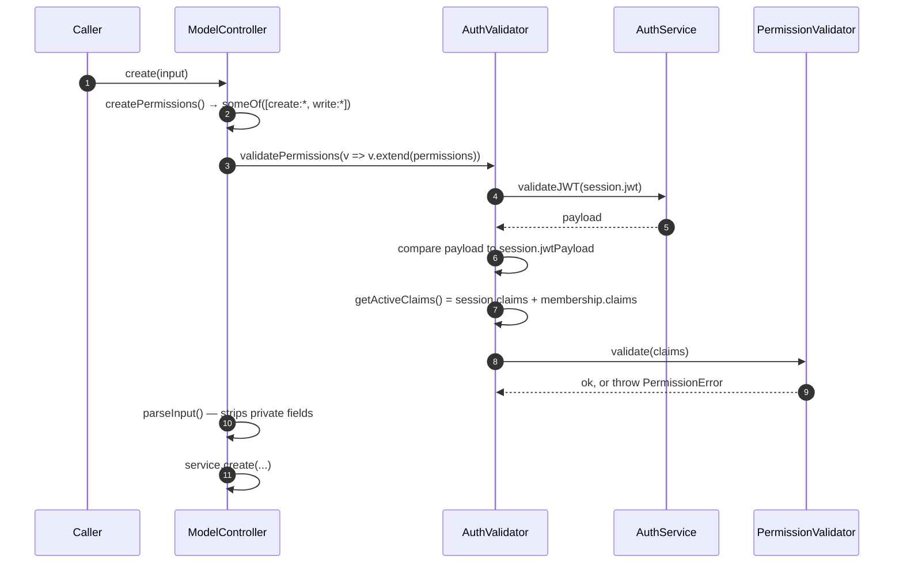

# How authentication and authorization work

A caller arrives with a JWT. `@declaro/auth` turns it into a **session** (a Redis
record holding claims and team memberships), and `PermissionValidator` decides
whether that session's claims satisfy what an operation requires.

For the step-by-step, read [`wiring-up.md`](./wiring-up.md). This document is the
why, and one behaviour that will surprise you.

## The split

| Concern | Answered by | Where |
|---|---|---|
| Who is this? | `AuthService` → `IAuthSession` | `lib/auth/src/domain/services/auth-service.ts:8` |
| What may they do here? | `AuthValidator` | `lib/auth/src/shared/utils/auth-validator.ts:13` |
| Does this claim set satisfy this rule? | `PermissionValidator` | `lib/core/src/auth/permission-validator.ts:29` |
| What does this operation require? | the controller | `lib/data/src/application/model-controller.ts` |

`PermissionValidator` lives in **core**, not auth, and knows nothing about
sessions — it matches strings against strings. That is what lets the data layer
build permission requirements (`read-only-model-controller.ts:146-151`) without
depending on `@declaro/auth` at runtime; the data package imports auth types only
(`model-controller.ts:1`), and type imports are erased.

## The JWT is decoded twice, and verified once

`AuthService` (`auth-service.ts:8`) is abstract; the only implementation is
`RedisAuthService` (`infrastructure/impl/redis-auth-service.ts:8`).

`decodeJWT` calls `jwt.decode` — **no signature check** (`auth-service.ts:31-39`).
`validateJWT` decodes first to check `exp`, then calls `jwt.verify`
(`auth-service.ts:41-59`). Only `validateJWT` is trustworthy.

`createSession` calls `decodeJWT`, not `validateJWT`
(`auth-service.ts:18`). Sessions are created from an unverified payload; the
verification happens on the read path, when the token comes back on a request.
That is safe only because the create path is under your control — a session is
minted by your own login flow, not by an untrusted caller.

### The signing secret has a development fallback

`getSecret` (`auth-service.ts:61-70`) reads `authConfig.signingSecret ??
process.env.APP_SECRET`, and if neither is set **and** `NODE_ENV !== 'production'`
it returns the literal string `'shhhhh'`. In production with no secret it returns
`undefined` and `jwt.verify` throws.

So a missing `APP_SECRET` does not fail loudly in staging — it silently signs and
verifies with a public constant. The `console.warn` at `auth-service.ts:64` is
the only signal, and it is suppressed under `NODE_ENV=test`.

## Claims come from two places

`IAuthSession` (`domain/models/auth-session.ts:79-95`) carries both global claims
and per-team memberships, each with their own claims:

```typescript
{
    id, jwt, jwtPayload, issued, expires,
    roles: string[],
    claims: string[],                        // global
    memberships: [{ id, claims, roles, team: { id, name } }],
}
```

`getActiveClaims` (`auth-validator.ts:57-71`) concatenates the session's global
claims with the claims of the **active membership** — the one matching the team
the request selected. If a team was selected but the session has no membership
for it, it throws `UnauthorizedError` (`auth-validator.ts:60-62`).

Which team is active comes from the `x-team` header, resolved during request
middleware (`application/module.ts:50-56`). A header naming a team the user does
not belong to throws `ForbiddenError` at resolve time
(`application/module.ts:58-60`) — before any permission check runs.

`roles` is stored on the session and on each membership, and **nothing reads it**.
Authorization is entirely claim-based; roles are carried for the application's
own use.

## The part that will surprise you: the glob is on the *required* side

`PermissionValidator.hasPermission` (`permission-validator.ts:86-94`):

```typescript
const matches = minimatch.match(permissions, permission)
return matches.length > 0
```

`permissions` is the user's claim list. `permission` is what the operation
requires. `minimatch.match(list, pattern)` treats the **second** argument as the
pattern.

So the required permission is the glob, and the user's claims are the subjects
matched against it. Wildcards in a *claim* do nothing. Verified:

| User's claim | Required | Grants? |
|---|---|---|
| `global::book.create:*` | `global::book.create:*` | ✅ |
| `global::book.create:detail` | `global::book.create:*` | ✅ |
| `global::book.create` | `global::book.create:*` | ❌ |
| `global::book.*` | `global::book.create:*` | ❌ |
| `global::*` | `global::book.create:*` | ❌ |
| `*` | `global::book.create:*` | ❌ |

Read the last three rows again. **There is no "admin" claim.** Granting `*` or
`global::*` grants nothing at all. A superuser must be issued the full, literal
claim string for every operation they can perform — or the required side must be
widened, which changes it for everyone.

The third row matters just as much: every permission the controllers build is
scoped `:*` (`read-only-model-controller.ts:148`), so a claim without a scope
segment does not match. Claims must carry the scope.

This is the single most likely cause of "the permission is granted but it still
403s".

### Rules compose, and nested validators are the AND-inside-OR trick

Three rule types (`permission-validator.ts:3-7`), all ANDed together — `validate`
throws on the first failure (`:96-106`):

| Rule | Passes when |
|---|---|
| `allOf([...])` | every entry matches |
| `someOf([...])` | at least one matches |
| `noneOf([...])` | none match |

An entry may be a string **or another `PermissionValidator`**
(`permission-validator.ts:9`, `:91-93`). That is how `upsert` expresses
"(create AND update) OR write" (`model-controller.ts:112-126`):

```typescript
const createAndUpdate = PermissionValidator.create().allOf([create, update])
return PermissionValidator.create().someOf([createAndUpdate, write])
```

`validate` throws `PermissionError`; `safeValidate` returns
`{ valid, errorMessage, errors }` (`:108-134`). A nested validator is always
evaluated with `safeValidate`, so its failure becomes a `false` rather than an
exception.

## What a controller call actually checks



`validateSession` (`auth-validator.ts:37-55`) does something unusual: it
re-verifies the JWT and then compares the fresh payload to the stored one with
`JSON.stringify` equality. A session whose stored payload has drifted from what
the token now decodes to is rejected. It is a strict check, and it is
key-order-sensitive — `JSON.stringify` equality is not structural equality.

Every check runs `validateSession` first (`auth-validator.ts:74`, `:95`), so an
expired or missing token is a 401 before permissions are ever consulted.

`validatePermissions(fn, strict = false)` returns a boolean instead of throwing
(`auth-validator.ts:84-89`) — that is the form to use for "should I show this
button", not for enforcement.

## Team-scoped checks are a separate method

`validateTeamPermissions(teamId, fn)` (`auth-validator.ts:94-117`) validates
against **only** that team's membership claims — the session's global claims are
not included. Compare `validatePermissions`, which uses global + active
membership.

So the two methods answer different questions, and picking the wrong one either
over-grants (global claims leaking into a team check) or under-grants (a global
admin claim ignored). `validateTeamPermissions` also lets you check a team other
than the active one, which is what it is really for.

## The decorator

`@ValidatePermissions(v => …)` (`shared/decorators/validate-permissions.ts:23`)
wraps a method with a permission check. It finds the validator via
`AuthValidator.createFromClass(this)`, which requires the instance to have a
property literally named `authValidator` (`auth-validator.ts:20-27`) — and throws
a descriptive error if not.

It is a **TC39 stage-3 decorator** (`ClassMethodDecoratorContext`), not a legacy
TypeScript one. It needs the modern decorator implementation enabled.

`ModelController` does not use it — it calls `validatePermissions` directly. The
decorator is for hand-written controllers.

## Where everything lives

| Piece | Path |
|---|---|
| Rule engine | `lib/core/src/auth/permission-validator.ts` |
| Session models | `lib/auth/src/domain/models/auth-session.ts` |
| JWT + session base | `lib/auth/src/domain/services/auth-service.ts` |
| Redis implementation | `lib/auth/src/infrastructure/impl/redis-auth-service.ts` |
| Session + claim checks | `lib/auth/src/shared/utils/auth-validator.ts` |
| Method decorator | `lib/auth/src/shared/decorators/validate-permissions.ts` |
| DI wiring | `lib/auth/src/application/module.ts` |
| Required permissions | `lib/data/src/application/{read-only-,}model-controller.ts` |
| Test doubles | `lib/auth/src/test/mock/` |

## Gotchas

- **Wildcard claims grant nothing.** `*` and `global::*` match no required
  permission (verified). The glob is on the required side.
- **Claims must include the scope segment.** Controllers require `…:*`; a claim
  of `global::book.create` does not match (verified).
- **`APP_SECRET` falls back to `'shhhhh'`** outside production.
- **`decodeJWT` does not verify.** Only `validateJWT` does.
- **`createSession` trusts its input.**
- **`roles` is never read.** Authorization is claims-only.
- **A bad `x-team` header is a `ForbiddenError` at resolve time**, before any
  permission check.
- **Permission action segments are kebab-case** (`permanently-delete-from-trash`)
  while the matching *event* action is camelCase — the descriptor kebab-cases
  namespace, resource and scope, never the action
  (`lib/core/src/shared/utils/action-descriptor.ts:26-30`).
- **Renaming an entity invalidates every granted claim** — the resource segment
  is `schema.name`.
- **`ModelController` has no `duplicate`**, so `ModelService.duplicate` has no
  permission gate.
- **`@declaro/auth` requires Redis.** `authModule` injects a `redis` key
  (`application/module.ts:19`).

## See also

- [`wiring-up.md`](./wiring-up.md) — wiring the module and granting claims
- [`docs/data/how-it-works.md`](../data/how-it-works.md) — what the controllers
  require, per operation
- [`docs/context/how-it-works.md`](../context/how-it-works.md) — the request
  scoping `authModule` depends on
