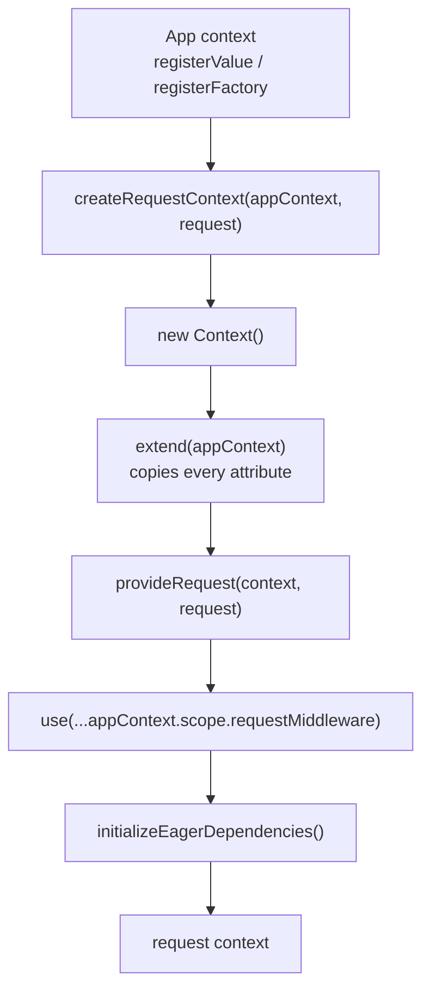

# How the context works

`Context` is Declaro's dependency-injection container and its request-scoping
mechanism. It is **opt-in**: nothing in `@declaro/core`, `@declaro/data` or
`@declaro/zod` requires it. `ModelService` takes plain constructor arguments, and
a whole application can be wired by hand.

Use it when you need per-request dependencies — an auth session, a tenant, a
request-scoped repository. Skip it otherwise.

For the step-by-step, read [`wiring-up.md`](./wiring-up.md). This document is the
why, and the warnings.

## What it is

A `Context` holds a map of string-keyed **attributes**, each describing how to
produce a value (`context.ts:128-141`):

```typescript
type ContextAttribute = {
    key: PropertyKey
    value?: (context, resolveOptions) => TValue
    type: DependencyType          // VALUE | FACTORY | CLASS
    resolveOptions?: ResolveOptions
    cachedValue?: TValue
    inject: PropertyKey[]         // keys this dependency needs
}
```

`registerValue`, `registerFactory`, `registerClass` and their async variants all
build one of these and hand it to `register` (`context.ts:388`, `:411`, `:481`).
`resolve(key)` walks the `inject` array, resolves each dependency, and calls
`value`.

`register` also defines a getter on `context.scope` (`context.ts:371-375`):

```typescript
Object.defineProperty(this.scope, key, { get: () => this.resolve(key), … })
```

So `context.scope.foo` and `context.resolve('foo')` are the same call. `scope`
exists to give the container a typed face — `Context<MyScope>` makes
`scope.foo` type-check — but it is not a cache.

## Nothing here is checked at compile time

This is the single most important property of the container, and it deserves to
be stated plainly.

`Context<Scope>` defaults `Scope` to `any` (`context.ts:273`), and keys are typed
`ScopeKey<Scope> = keyof Scope`. With `Scope = any`, `keyof any` is
`string | number | symbol` — **every string is a valid key**. A typo in a
`resolve` call type-checks.

And resolution is non-strict by default (`context.ts:243-249`). Verified:

```
context.resolve('doesNotExist')  →  undefined
```

No error, no warning. The failure surfaces later as `Cannot read properties of
undefined` somewhere unrelated.

Two mitigations, in order of preference:

1. **Don't use the container** where you have the choice. `new ModelService({
   schema, emitter, repository })` is compiler-checked and greppable.
2. **Declare a scope interface** so `Context<AppScope>` constrains the keys, and
   pass `{ strict: true }` on resolves that must not silently return `undefined`
   (`context.ts:754-756`, `:811-813`).

When you must add a key, grep for the exact string first — `registerValue('key'`,
`registerFactory('key'`, `registerClass('key'`, `resolve('key'` — and reuse it
verbatim.

## Singleton is off by default

Every DI container has a default lifetime, and this one's is the opposite of what
most people expect (`context.ts:243-249`):

```typescript
export function defaultResolveOptions(): ResolveOptions {
    return { strict: false, eager: false, singleton: false }
}
```

Verified — `registerClass('thing', Thing)` with no options:

```
resolve('thing').id      →  1
resolve('thing').id      →  2
scope.thing.id           →  3
```

Three accesses, three instances. With `{ singleton: true }`, one.

That matters most for things that hold state or a connection — a Redis client, a
repository with a cache, an event manager. Registering one without
`{ singleton: true }` gives every consumer its own.

`registerValue` is not affected in practice, because its loader is
`() => value` — a closure over the same reference every time. Factories and
classes are.

### A singleton whose value is falsy is never cached

`_resolveValue` checks the cache with a truthiness test
(`context.ts:767`):

```typescript
} else if (serveFromCache && attribute?.cachedValue && dependenciesValid) {
```

So a cached `0`, `''`, `false`, `null` or `undefined` reads as "no cache" and the
factory runs again. Verified:

```
registerFactory('zero', () => 0, undefined, { singleton: true })
resolve × 3  →  factory invoked 3 times

registerFactory('obj', () => ({a:1}), undefined, { singleton: true })
resolve × 3  →  factory invoked 1 time
```

For a pure factory this is only wasted work. For one with side effects — opening
a connection, registering a listener — it happens on every resolve.

`_cacheIsValid` uses the stricter `!== undefined && !== null`
(`context.ts:630`), so the two checks disagree about `0`, `''` and `false`. If
you need a falsy singleton, box it: `{ value: 0 }`.

## Circular dependencies, and what the proxy costs

`_resolveValue` creates a `Proxy` placeholder for each key before resolving it
(`context.ts:649-723`, `:776-780`). If resolution comes back around to the same
key, the second resolve receives the proxy; once the real value exists,
`__resolve(target)` points the proxy at it and every trap forwards
(`context.ts:679-681`).

This works, and it is the reason the container can wire two services that
reference each other. It also means a dependency can, for a window, hold an
object that is not yet the real one. Three consequences:

- **A constructor that *calls* an injected circular dependency during
  construction gets the empty placeholder**, not the real object. Store the
  reference, use it later.
- **Identity comparisons can fail.** The proxy is not `===` the target.
  `isProxy(value)` (`context.ts:188`) and `value.valueOf()` exist for this.
- **`Object.keys` on an unresolved proxy returns the placeholder's keys.** After
  resolution the traps forward, so it is only a hazard during construction.

This is the most intricate code in the repository. Treat a change to
`_resolveValue` or `createProxy` as high-blast-radius and cover it with the
existing `context.circular-deps.test.ts`.

## Request scoping

An app has one long-lived context. A request gets its own, built per request
(`lib/core/src/application/create-request-context.ts:4-19`):



The mechanism is **override by re-registration**. `extend` copies the app
context's attributes into the new one (`context.ts:886-898`); request middleware
then calls `registerAsyncFactory` on the *same* keys, replacing the copies.
`authModule` does exactly this: it registers `authSession` as `async () => null`
on the app context, then re-registers it inside request middleware to read the
`authorization` header (`lib/auth/src/application/module.ts:22`, `:27-43`).

That is why a request-scoped dependency must also be registered at the app level:
resolving it outside a request must not explode, so the app-level registration is
the null case.

Two properties of `extend` to keep in mind:

- **It copies attributes shallowly**, `{ ...context.state[key] }`
  (`context.ts:889`), and that includes `cachedValue`. A singleton already
  resolved on the app context arrives in the request context pre-cached — usually
  what you want, occasionally not.
- **It also merges the event listeners** (`context.ts:894`) via
  `EventManager.extend`, which is a one-time copy. Listeners added to the app
  context *after* a request context was created do not reach it.

`requestMiddleware` itself is just an array under a well-known key.
`provideRequestMiddleware` reads it, appends, and re-registers
(`lib/core/src/http/request-context.ts:18-29`) — so ordering is registration
order, and a module registered later runs later.

## The async context, and why it exists

`withContext` / `useContext` (`context/async-context.ts`) bind a context to the
current async execution, backed by Node's `AsyncLocalStorage`. That is how code
deep inside a call stack — a `normalizeLookup` hook that needs the tenant, a
listener that needs the session — reaches the request context without it being
threaded through every signature.

`Context.on` wraps every listener so it receives the *ambient* context if there
is one, falling back to the context it was registered on (`context.ts:946-950`):

```typescript
return listener((useContext() ?? this) as this, event as E)
```

and `Context.emit` establishes that ambient context around the emission
(`context.ts:958-962`). So a listener registered on the app context, fired during
a request, sees the request context.

In browser builds `node:async_hooks` is swapped for a synchronous shim
(`lib/core/src/shims/async-local-storage.ts`). Its documented limit
(`async-context.ts:50-54`): context propagates across sequential async flows but
**not across concurrent async tasks running in parallel**.

## Two buses, not one

`Context` has its own `EventManager` (`context.ts:275`), exposed as
`context.events` and used by `context.on` / `context.emit`. It is **not** the
emitter a `ModelService` was constructed with unless you deliberately passed the
same instance.

`context.on('global::book.afterCreate', …)` therefore does nothing by default.
Model events go to the service's emitter; app lifecycle events
(`declaro:init`, `declaro:start`, `declaro:destroy` — `app/app.ts:15-19`) go to
the context's.

The clean fix is to register the `EventManager` in the container and inject the
same instance into every service.

## The `App` wrapper

`App` (`lib/core/src/app/app.ts:12`) is a thin lifecycle shell: `init()` runs
eager dependencies then emits `declaro:init`; `start()` emits `declaro:start`;
`destroy()` emits — `declaro:start` (`app.ts:41`).

That is not a typo in this document. `destroy()` emits `App.Events.Start`, so
`onDestroy` listeners never fire and `onStart` listeners fire twice. Do not build
shutdown logic on it. `onStart` also returns `undefined` rather than `this`
(`app.ts:37`), breaking the chaining its siblings support.

## Where everything lives

| Piece | Path |
|---|---|
| The container | `lib/core/src/context/context.ts` |
| Async binding | `lib/core/src/context/async-context.ts` |
| Browser shim | `lib/core/src/shims/async-local-storage.ts` |
| Context validators | `lib/core/src/context/validators.ts` |
| Request-context factory | `lib/core/src/application/create-request-context.ts` |
| Base middleware registration | `lib/core/src/application/use-declaro.ts` |
| Middleware helpers | `lib/core/src/http/request-context.ts` |
| Scope interfaces to augment | `lib/core/src/scope/index.ts` |
| Lifecycle wrapper | `lib/core/src/app/app.ts` |
| Container tests | `lib/core/src/context/context.test.ts`, `context.circular-deps.test.ts` |

## Gotchas

- **Every string key type-checks** on a `Context<any>`, and an unknown key
  resolves to `undefined` (verified).
- **Not singleton by default.** Three resolves, three instances (verified).
- **A falsy singleton is re-created on every resolve** (verified).
- **`context.scope.foo` is a resolve**, not a cached read.
- **`extend` copies `cachedValue`** and copies listeners once.
- **`Context.on` is a different bus** from a service's `EventManager`.
- **`App.destroy()` emits `declaro:start`** (`app.ts:41`).
- **`provide`, `inject` and `ContextConsumer` are `@deprecated`**
  (`context.ts:323`, `:824`, `context-consumer.ts:5`). `singleton()` is built on
  the deprecated pair (`context.ts:854-862`).
- **`useRequestMiddleware` is deprecated** in favour of
  `context.scope.requestMiddleware` (`http/request-context.ts:8`).

## See also

- [`wiring-up.md`](./wiring-up.md) — registering dependencies and request
  middleware
- [`docs/auth/how-it-works.md`](../auth/how-it-works.md) — the one module in this
  repo that wires itself entirely through the container
- [`docs/events/how-it-works.md`](../events/how-it-works.md) — the other bus
