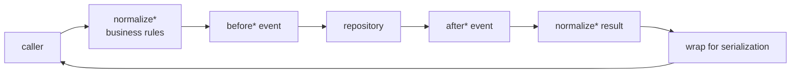

# How the data layer works

`@declaro/data` turns a `ModelSchema` into a CRUD pipeline. You supply the schema
and a repository; the package supplies a typed service that brackets every
operation with events and normalization hooks, and an optional controller that
enforces permissions in front of it.

```
ModelSchema  →  IRepository  →  ModelService  →  ModelController
(shapes)        (storage)       (events +         (permissions +
                                normalization)     input validation)
```

For the step-by-step of standing one up, read [`wiring-up.md`](./wiring-up.md).
This document is the why.

## Four layers, and what each one is not allowed to know

| Layer | Knows | Does not know |
|---|---|---|
| `IRepository` | the storage engine | events, permissions, business rules |
| `ReadOnlyModelService` / `ModelService` | business rules, event names | who the caller is, the storage engine |
| `ReadOnlyModelController` / `ModelController` | permissions, untrusted input | the storage engine, event names |
| `ModelSchema` | shapes | all of the above |

The seam that matters most is the repository one. `IRepository<TSchema>`
(`domain/interfaces/repository.ts:13`) is thirteen methods, all typed off the
schema, and the service **never instantiates one** — it takes it as a constructor
argument (`domain/services/base-model-service.ts:31`). Backing an entity with
Postgres instead of memory is one class, and nothing above it changes.

The service does not know about the caller either. There is no session, no user,
no permission check anywhere in `ModelService`. That lives entirely in the
controller, which is why an internal service call and an HTTP request take
genuinely different paths rather than one path with a flag.

## The shape of every mutation

Every method on `ModelService` has the same five-step body. `create`
(`model-service.ts:230-267`) is representative:

```typescript
const normalizedInput = await this.normalizeInput(input, { descriptor })   // 1
await this.emitter.emitAsync(beforeCreateEvent)                            // 2
const result = await this.repository.create(normalizedInput, options)      // 3
await this.emitter.emitAsync(afterCreateEvent)                             // 4
return this.wrapDetail(await this.normalizeDetail(result))                 // 5
```



Three properties of that ordering are load-bearing:

- **Normalization runs before the before-event**, so a listener sees the input
  the repository will actually receive, not the input the caller sent.
- **The result is normalized before it is wrapped**, and the wrap is last
  (`read-only-model-service.ts:135-136` says so explicitly): *"Wrapping last
  means a normalize hook that spreads the record cannot undo it."* A hook that
  does `{ ...record, extra }` would otherwise discard the prototype carrying
  `toJSON`, and private fields would leak.
- **The repository call is not wrapped in a transaction.** There is no
  transaction seam anywhere in the package. An after-event listener that throws
  aborts the caller *after* the write has landed.

## Normalization is the extension point

Five `normalize*` hooks exist, and overriding them is how an entity gets business
rules without a subclass touching the event machinery:

| Hook | Runs on | Declared |
|---|---|---|
| `normalizeInput` | every write, before the repository | `model-service.ts:52` |
| `normalizeLookup` | every addressed operation | `read-only-model-service.ts:89` |
| `normalizeSort` | `search` | `read-only-model-service.ts:101` |
| `normalizeDetail` | every returned detail | `read-only-model-service.ts:65` |
| `normalizeSummary` | every returned summary | `read-only-model-service.ts:77` |

`normalizeInput` receives a descriptor telling it which operation it is running
under, and the existing record on an update (`model-service.ts:52-57`,
`:277-280`). That is what makes "set `createdBy` on create, leave it alone on
update" a three-line override rather than two overridden methods.

`normalizeLookup` is the tenancy hook. Because it runs on *every* path that
addresses a record — `load`, `loadMany`, `update`, `remove`, `restore`,
`permanentlyDelete` — pinning a tenant there covers them all, and covers new ones
the day they are written.

The two result hooks carry an explicit warning in their own doc comments
(`read-only-model-service.ts:60-63`, `:70-75`): they run **once per record**, in
parallel, on every list. A query inside `normalizeSummary` is an N+1 on every
search page. Batch work belongs in an overridden `search`, not here.

## Why events are bracketed rather than emitted once

Every operation emits a `before*` and an `after*` event, both carrying the same
`ActionDescriptor`-derived type string. The pair exists because the two are used
for different things: `before*` for validation and enrichment (it can throw and
abort the operation), `after*` for reactions.

The `after*` event carries the result via `.setResult(result)`
(`domain/events/request-event.ts:35-39`), and `create`/`update`/`duplicate`
additionally attach `existing` and the original call arguments as meta
(`model-service.ts:291`, `:307`). A listener therefore gets before-state and
after-state without re-querying — which is exactly what a reactor like an
activity log or a notification pipeline needs.

Two irregularities in that scheme are worth internalising, because both are
easy to trip over and neither is documented in the code:

**`doNotDispatchEvents` is not honoured everywhere.** `create`, `update`,
`upsert`, `bulkUpsert` and `duplicate` all gate their emissions on it. `remove`,
`restore`, `emptyTrash`, `permanentlyDelete` and `permanentlyDeleteFromTrash` do
not — they emit unconditionally (`model-service.ts:160-190`, `:198-228`,
`:529-549`, `:556-578`, `:585-607`). Verified: calling
`remove(lookup, { doNotDispatchEvents: true })` still emits
`beforeRemove` and `afterRemove`.

**`upsert` and `bulkUpsert` emit thinner events.** They construct their
`MutationEvent` without `.setMeta(...)` (`model-service.ts:363-366`, `:481-484`),
so a listener on `beforeUpdate` sees `meta.existing` when the update came from
`update()` and an empty `meta` when the identical update came from `upsert()`. A
reactor that diffs against `meta.existing` silently does nothing on the upsert
path.

## Which events an operation actually emits

Because `upsert` resolves to a create or an update *before* emitting, there is no
`beforeUpsert` event — it emits create or update events depending on what it
found (`model-service.ts:329-353`):

| Called | Emits |
|---|---|
| `create` | `beforeCreate`, `afterCreate` |
| `update` | `beforeUpdate`, `afterUpdate` |
| `upsert` (no PK, or PK not found) | `beforeCreate`, `afterCreate` |
| `upsert` (PK found) | `beforeUpdate`, `afterUpdate` |
| `bulkUpsert` | one create-or-update pair **per input** |
| `duplicate` | `beforeDuplicate`, `beforeCreate`, `afterCreate`, `afterDuplicate` |
| `remove` | `beforeRemove`, `afterRemove` — always |

So a listener on `beforeCreate` covers `create`, `upsert`, `bulkUpsert` and the
create half of `duplicate`. That is the point: subscribe to the operation, not to
the method.

`bulkUpsert` emits its before-events with `Promise.all`
(`model-service.ts:489`), so per-input listeners run concurrently and in no
guaranteed order relative to each other.

Event naming, and how to subscribe to these strings, is
[`docs/events/`](../events/how-it-works.md).

## What `duplicate` is really doing

`duplicate` (`model-service.ts:101-153`) is the one method with non-obvious
mechanics, and it is worth reading once because the technique it uses —
`detailsToInput` — is reusable.

```
load(lookup)  →  detailsToInput(detail)  →  delete input[primaryKey]
              →  merge overrides         →  create(...)
```

`detailsToInput` (`model-service.ts:67-90`) picks only the fields that exist on
the *input* model's JSON Schema and runs them through it to coerce. It uses
`Object.prototype.hasOwnProperty` rather than `in`, and says why
(`model-service.ts:73-74`): a detail returned by a service is wrapped for
serialization, and `in` would also match the methods the wrapper adds.

That makes it a general "convert any record into a valid input for this entity",
usable for cross-entity conversion, not just duplication.

The primary key is deleted **only if `entityMetadata?.primaryKey` is set**
(`model-service.ts:116-118`). If `.entity()` silently failed, `duplicate` copies
the primary key straight through and the create either collides or overwrites.

## The controller layer, and what it adds

`ModelController` wraps the service with exactly two concerns.

**Permissions.** Each method has a paired `*Permissions` method returning a
`PermissionValidator`, then calls
`authValidator.validatePermissions((v) => v.extend(permissions))`
(`application/model-controller.ts:55-60`). Splitting the permission set into its
own overridable method is what lets a subclass tighten one operation without
reimplementing it.

The permission strings are built from the same descriptor the events use, but
with `'*'` as the scope — `global::book.create:*`
(`base-model-service.ts:35-42`). Most operations accept a specific permission
**or** a coarse one: `load` accepts `load` or `read`; `create` accepts `create`
or `write` (`read-only-model-controller.ts:152-157`,
`model-controller.ts:48-53`). `upsert` is the exception: it requires
(`create` **and** `update`) **or** `write` (`model-controller.ts:112-126`).

**Input validation.** `parseInput` runs the payload through the input model
(`model-controller.ts:29-37`), which coerces values and — because
`Model.validate` strips before it validates — removes any field marked
`private: true`. That is the mechanism by which a client cannot write to a
service-owned field. It works only on the controller path; a direct service call
does not parse input.

Two absences in the controller are deliberate to notice:

- **There is no `duplicate` method.** `ModelService.duplicate` exists;
  `ModelController` does not expose it, so it has no permission gate. Exposing it
  over HTTP means writing the method and its `*Permissions` pair yourself.
- **`serialize*` does not serialize.** The class doc comment is explicit
  (`read-only-model-controller.ts:22`): it attaches a `toJSON` and nothing is
  removed until something calls `JSON.stringify`. See
  [`docs/serialization/`](../serialization/how-it-works.md).

## Where everything lives

| Piece | Path |
|---|---|
| Persistence seam | `lib/data/src/domain/interfaces/repository.ts` |
| Constructor args | `lib/data/src/domain/services/model-service-args.ts` |
| Descriptors + wrapping | `lib/data/src/domain/services/base-model-service.ts` |
| Reads | `lib/data/src/domain/services/read-only-model-service.ts` |
| Writes | `lib/data/src/domain/services/model-service.ts` |
| Read controller | `lib/data/src/application/read-only-model-controller.ts` |
| Write controller | `lib/data/src/application/model-controller.ts` |
| Event names | `lib/data/src/domain/events/event-types.ts` |
| Pagination models | `lib/data/src/domain/models/pagination.ts` |
| Type inference | `lib/data/src/shared/utils/schema-inference.ts` |
| Reference repository | `lib/data/src/test/mock/repositories/mock-memory-repository.ts` |

## How it is tested

Tests sit beside their implementation (`*.test.ts`).
`MockMemoryRepository` (`test/mock/repositories/mock-memory-repository.ts`) is
the reference `IRepository` — an in-memory map with a separate trash map — and
`MockBookSchema` the reference entity. A service test is a real `ModelService`
over a real `EventManager` and a `MockMemoryRepository`; assert the rows and the
events, not the calls.

Both mocks are exported from `@declaro/data`'s public index, which is convenient
in tests and a hazard in production bundles.

## Gotchas

- **`remove`, `restore`, `emptyTrash` and both permanent deletes ignore
  `doNotDispatchEvents`.** Verified.
- **`upsert`/`bulkUpsert` emit events with empty `meta`** — no `existing`, no
  `args`.
- **`normalizeDetail`/`normalizeSummary` run per record.** Do not query in them.
- **A normalize hook that spreads the record drops the serialization wrapper**
  if it runs after wrapping. It does not today, because wrapping is last — keep
  it that way in any override.
- **No transactions.** A throwing after-event listener leaves the write in place
  and fails the caller.
- **`ModelController` has no `duplicate`.**
- **`load` returns whatever the repository returned**, including `null`, despite
  the `Promise<InferDetail<TSchema>>` signature — `IRepository.load` is typed
  `Promise<InferDetail<TSchema> | null>` (`repository.ts:20`) and the service
  does not narrow it (`read-only-model-service.ts:111`).

## See also

- [`wiring-up.md`](./wiring-up.md) — standing up a service and a repository
- [`docs/schema/how-it-works.md`](../schema/how-it-works.md) — where the types
  come from
- [`docs/events/how-it-works.md`](../events/how-it-works.md) — the event names
  and the bus
- [`docs/auth/how-it-works.md`](../auth/how-it-works.md) — what the controller's
  permission strings are matched against
